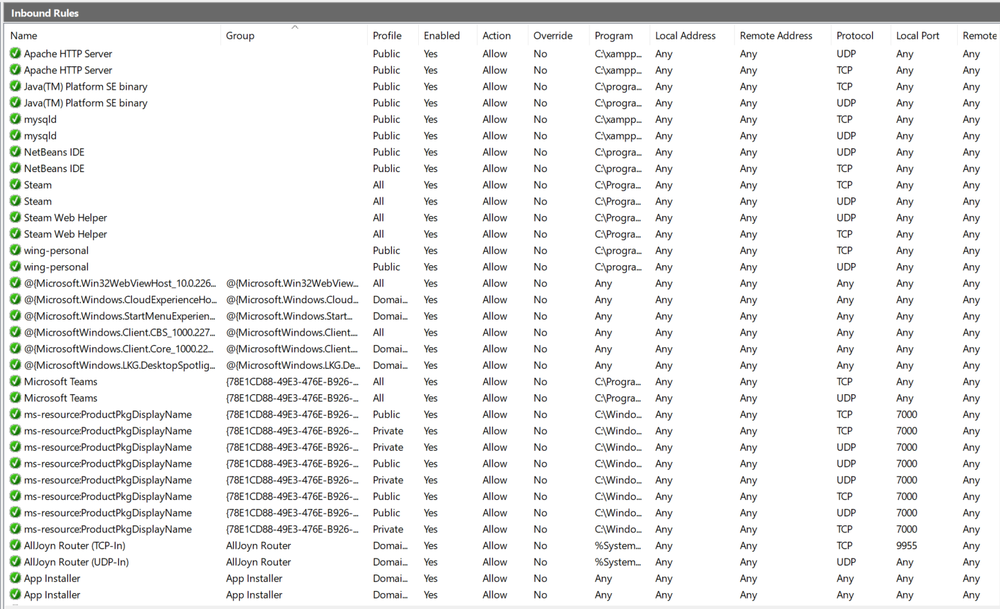
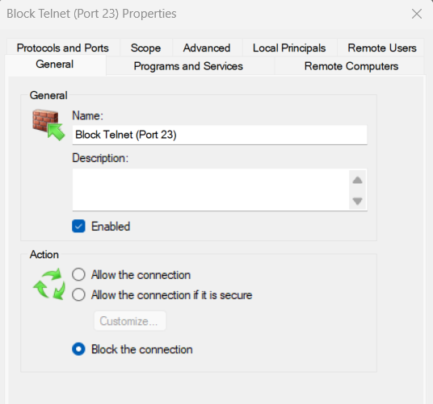
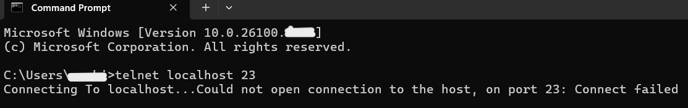

# Task 4: Setup and Use a Firewall (Windows)

**Author:** Anshikaa Pahilajani  
**Cyber Security Internship — Elevate Labs**  
**Date:** 26 September 2025

## Objective
Configure and test basic firewall rules to allow or block traffic.

## Tools Used
- Windows Defender Firewall with Advanced Security
- Command Prompt (Telnet Client)

## Steps Performed

1. **Opened Firewall Configuration Tool**
   - Opened `wf.msc` to launch Windows Defender Firewall.
   
2. **Listed Current Firewall Rules**
   - Viewed Inbound Rules to check existing configurations.  
   

3. **Added Rule to Block Port 23 (Telnet)**
   - Created a new inbound rule for TCP port 23.  
   - Configured action as **Block the connection**.  
   - Applied to all profiles (Domain, Private, Public).  
   

4. **Tested the Rule**
   - Ran `telnet localhost 23` in Command Prompt.  
   - Result: Connection failed (traffic blocked as expected).  
   

5. **Removed the Block Rule**
   - Deleted the inbound rule for port 23 to restore firewall to original state.

## Summary of Firewall Filtering
- Firewall filters traffic by allowing or blocking packets based on port, IP, or protocol.  
- Port 23 (Telnet) was blocked to prevent insecure connections.  
- Test confirmed the connection was denied.  
- The test rule was removed to restore the firewall to its original state.

## Outcome
- Hands-on experience in configuring Windows Firewall.  
- Learned to create, test, and remove rules.  
- Demonstrated firewall’s role in securing systems against unauthorized access.

## Full Report
- Download the full report [here](Report.pdf).
